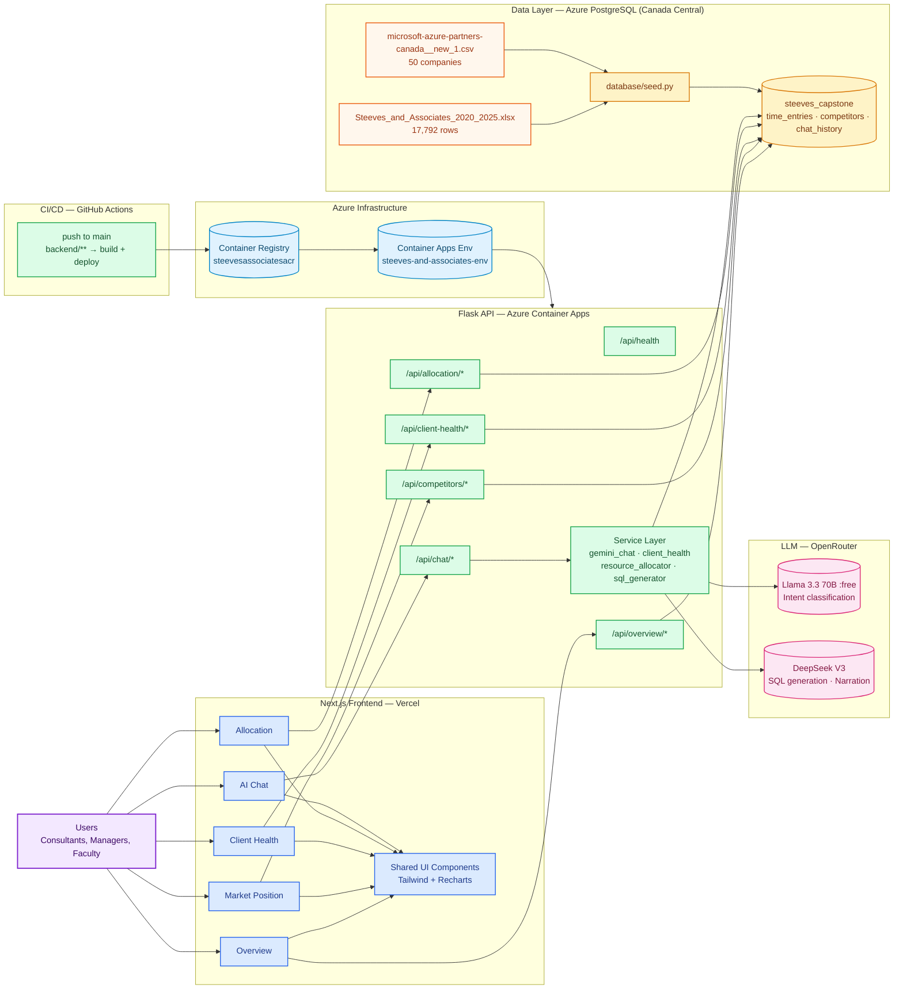

# System Architecture Diagram

```mermaid
flowchart LR
  U[Users<br/>Consultants, Managers, Faculty]:::actor

  subgraph FE["Next.js Frontend — Vercel"]
    OV[Overview]:::frontend
    MK[Market Position]:::frontend
    CL[Client Health]:::frontend
    AL[Allocation]:::frontend
    CH[AI Chat]:::frontend
    UI[Shared UI Components<br/>Tailwind + Recharts]:::frontend
  end

  subgraph BE["Flask API — Azure Container Apps"]
    HEALTH["/api/health"]:::backend
    OVAPI["/api/overview/*"]:::backend
    CPAPI["/api/competitors/*"]:::backend
    CLAPI["/api/client-health/*"]:::backend
    ALAPI["/api/allocation/*"]:::backend
    CHATAPI["/api/chat/*"]:::backend
    SERV["Service Layer<br/>gemini_chat · client_health<br/>resource_allocator · sql_generator"]:::backend
  end

  subgraph DATA["Data Layer — Azure PostgreSQL (Canada Central)"]
    PG[(steeves_capstone<br/>time_entries · competitors · chat_history)]:::database
    SEED[database/seed.py]:::database
    XLSX[Steeves_and_Associates_2020_2025.xlsx<br/>17,792 rows]:::source
    CSV[microsoft-azure-partners-canada__new_1.csv<br/>50 companies]:::source
  end

  subgraph AI["LLM — OpenRouter"]
    LLAMA[(Llama 3.3 70B :free<br/>Intent classification)]:::llm
    DEEP[(DeepSeek V3<br/>SQL generation · Narration)]:::llm
  end

  subgraph INFRA["Azure Infrastructure"]
    ACR[(Container Registry<br/>steevesassociatesacr)]:::infra
    CAE[(Container Apps Env<br/>steeves-and-associates-env)]:::infra
  end

  subgraph CICD["CI/CD — GitHub Actions"]
    GHA[push to main<br/>backend/** → build + deploy]:::cicd
  end

  U --> OV & MK & CL & AL & CH
  OV & MK & CL & AL & CH --> UI

  OV --> OVAPI
  MK --> CPAPI
  CL --> CLAPI
  AL --> ALAPI
  CH --> CHATAPI

  OVAPI & CPAPI & CLAPI & ALAPI --> PG
  CHATAPI --> SERV
  SERV --> PG
  SERV --> LLAMA
  SERV --> DEEP

  XLSX --> SEED
  CSV --> SEED
  SEED --> PG

  GHA --> ACR --> CAE --> BE

  classDef actor fill:#F3E8FF,stroke:#7E22CE,color:#3B0764,stroke-width:2px;
  classDef frontend fill:#DBEAFE,stroke:#2563EB,color:#1E3A8A,stroke-width:1.5px;
  classDef backend fill:#DCFCE7,stroke:#16A34A,color:#14532D,stroke-width:1.5px;
  classDef database fill:#FEF3C7,stroke:#D97706,color:#78350F,stroke-width:1.5px;
  classDef source fill:#FFF7ED,stroke:#EA580C,color:#9A3412,stroke-width:1.5px;
  classDef llm fill:#FCE7F3,stroke:#DB2777,color:#831843,stroke-width:1.5px;
  classDef infra fill:#E0F2FE,stroke:#0284C7,color:#0C4A6E,stroke-width:1.5px;
  classDef cicd fill:#DCFCE7,stroke:#16A34A,color:#14532D,stroke-width:1.5px;
```
