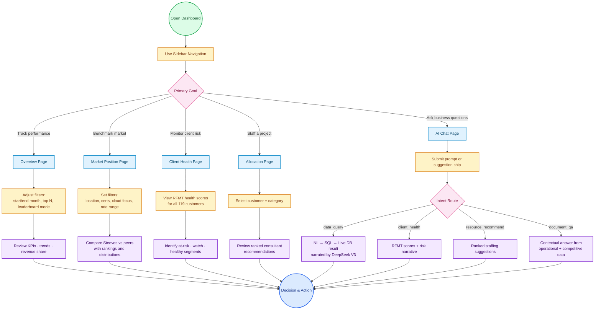

# User Flow Diagram

```mermaid
flowchart TD
  A((Open Dashboard)):::start --> B[Use Sidebar Navigation]:::action
  B --> C{Primary Goal}:::decision

  C -->|Track performance| D[Overview Page]:::page
  D --> D1[Adjust filters:<br/>start/end month, top N, leaderboard mode]:::action
  D1 --> D2[Review KPIs · trends · revenue share]:::insight

  C -->|Benchmark market| E[Market Position Page]:::page
  E --> E1[Set filters:<br/>location, certs, cloud focus, rate range]:::action
  E1 --> E2[Compare Steeves vs peers<br/>with rankings and distributions]:::insight

  C -->|Monitor client risk| F[Client Health Page]:::page
  F --> F1[View RFMT health scores<br/>for all 119 customers]:::action
  F1 --> F2[Identify at-risk · watch · healthy segments]:::insight

  C -->|Staff a project| G[Allocation Page]:::page
  G --> G1[Select customer + category]:::action
  G1 --> G2[Review ranked consultant<br/>recommendations]:::insight

  C -->|Ask business questions| H[AI Chat Page]:::page
  H --> H1[Submit prompt or suggestion chip]:::action
  H1 --> H2{Intent Route}:::decision
  H2 -->|data_query| H3[NL → SQL → Live DB result<br/>narrated by DeepSeek V3]:::insight
  H2 -->|client_health| H4[RFMT scores + risk narrative]:::insight
  H2 -->|resource_recommend| H5[Ranked staffing suggestions]:::insight
  H2 -->|document_qa| H6[Contextual answer from<br/>operational + competitive data]:::insight

  D2 --> Z((Decision & Action)):::finish
  E2 --> Z
  F2 --> Z
  G2 --> Z
  H3 --> Z
  H4 --> Z
  H5 --> Z
  H6 --> Z

  classDef start fill:#DCFCE7,stroke:#16A34A,color:#14532D,stroke-width:2px;
  classDef finish fill:#DBEAFE,stroke:#2563EB,color:#1E3A8A,stroke-width:2px;
  classDef page fill:#E0F2FE,stroke:#0284C7,color:#0C4A6E,stroke-width:1.5px;
  classDef action fill:#FEF3C7,stroke:#D97706,color:#78350F,stroke-width:1.5px;
  classDef decision fill:#FCE7F3,stroke:#DB2777,color:#831843,stroke-width:1.5px;
  classDef insight fill:#F3E8FF,stroke:#7E22CE,color:#3B0764,stroke-width:1.5px;
```
