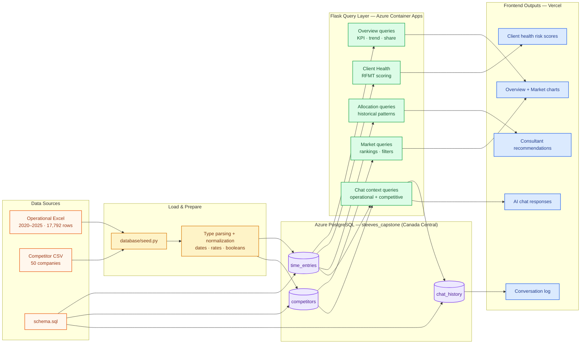

# Data Pipeline Diagram

```mermaid
flowchart LR
  subgraph SRC["Data Sources"]
    X[Operational Excel<br/>2020–2025 · 17,792 rows]:::source
    C[Competitor CSV<br/>50 companies]:::source
    S[schema.sql]:::source
  end

  subgraph ETL["Load & Prepare"]
    SEED[database/seed.py]:::process
    MAP[Type parsing + normalization<br/>dates · rates · booleans]:::process
  end

  subgraph DB["Azure PostgreSQL — steeves_capstone (Canada Central)"]
    T1[(time_entries)]:::table
    T2[(competitors)]:::table
    T3[(chat_history)]:::table
  end

  subgraph API["Flask Query Layer — Azure Container Apps"]
    OQ[Overview queries<br/>KPI · trend · share]:::api
    MQ[Market queries<br/>rankings · filters]:::api
    HQ[Client Health<br/>RFMT scoring]:::api
    AQ[Allocation queries<br/>historical patterns]:::api
    CQ[Chat context queries<br/>operational + competitive]:::api
  end

  subgraph UX["Frontend Outputs — Vercel"]
    CHARTS[Overview + Market charts]:::output
    HEALTH[Client health risk scores]:::output
    ALLOC[Consultant recommendations]:::output
    CHAT[AI chat responses]:::output
    AUDIT[Conversation log]:::output
  end

  X --> SEED
  C --> SEED
  S --> T1 & T2 & T3
  SEED --> MAP
  MAP --> T1 & T2

  T1 --> OQ & HQ & AQ & CQ
  T2 --> MQ & CQ
  CQ --> T3

  OQ --> CHARTS
  MQ --> CHARTS
  HQ --> HEALTH
  AQ --> ALLOC
  CQ --> CHAT
  T3 --> AUDIT

  classDef source fill:#FFF7ED,stroke:#EA580C,color:#9A3412,stroke-width:1.5px;
  classDef process fill:#FEF3C7,stroke:#D97706,color:#78350F,stroke-width:1.5px;
  classDef table fill:#EDE9FE,stroke:#7C3AED,color:#4C1D95,stroke-width:1.5px;
  classDef api fill:#DCFCE7,stroke:#16A34A,color:#14532D,stroke-width:1.5px;
  classDef output fill:#DBEAFE,stroke:#2563EB,color:#1E3A8A,stroke-width:1.5px;
```
