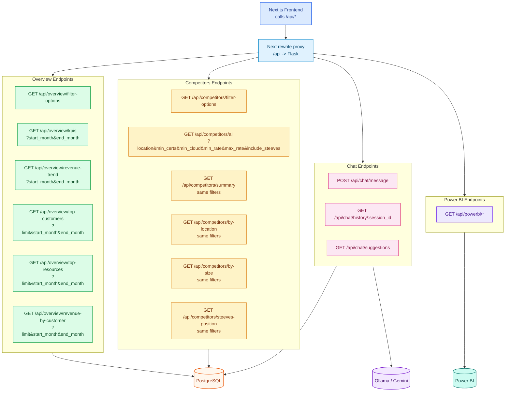

# API Surface and Ownership Diagram

```mermaid
flowchart TB
  UI[Next.js Frontend<br/>calls /api/*]:::frontend --> PROXY[Next rewrite proxy<br/>/api -> Flask]:::proxy

  PROXY --> OVG
  PROXY --> MKG
  PROXY --> CHG
  PROXY --> PBG

  subgraph OVG["Overview Endpoints"]
    O1[GET /api/overview/filter-options]:::overview
    O2[GET /api/overview/kpis<br/>?start_month&end_month]:::overview
    O3[GET /api/overview/revenue-trend<br/>?start_month&end_month]:::overview
    O4[GET /api/overview/top-customers<br/>?limit&start_month&end_month]:::overview
    O5[GET /api/overview/top-resources<br/>?limit&start_month&end_month]:::overview
    O6[GET /api/overview/revenue-by-customer<br/>?limit&start_month&end_month]:::overview
  end

  subgraph MKG["Competitors Endpoints"]
    M1[GET /api/competitors/filter-options]:::market
    M2[GET /api/competitors/all<br/>?location&min_certs&min_cloud&min_rate&max_rate&include_steeves]:::market
    M3[GET /api/competitors/summary<br/>same filters]:::market
    M4[GET /api/competitors/by-location<br/>same filters]:::market
    M5[GET /api/competitors/by-size<br/>same filters]:::market
    M6[GET /api/competitors/steeves-position<br/>same filters]:::market
  end

  subgraph CHG["Chat Endpoints"]
    C1[POST /api/chat/message]:::chat
    C2[GET /api/chat/history/:session_id]:::chat
    C3[GET /api/chat/suggestions]:::chat
  end

  subgraph PBG["Power BI Endpoints"]
    P1[GET /api/powerbi/*]:::pbi
  end

  OVG --> DB[(PostgreSQL)]:::db
  MKG --> DB
  CHG --> DB
  CHG --> LLM[(Ollama / Gemini)]:::llm
  PBG --> EXT[(Power BI)]:::external

  classDef frontend fill:#DBEAFE,stroke:#2563EB,color:#1E3A8A,stroke-width:1.5px;
  classDef proxy fill:#E0F2FE,stroke:#0284C7,color:#0C4A6E,stroke-width:1.5px;
  classDef overview fill:#DCFCE7,stroke:#16A34A,color:#14532D,stroke-width:1.2px;
  classDef market fill:#FEF3C7,stroke:#D97706,color:#78350F,stroke-width:1.2px;
  classDef chat fill:#FCE7F3,stroke:#DB2777,color:#831843,stroke-width:1.2px;
  classDef pbi fill:#EDE9FE,stroke:#7C3AED,color:#4C1D95,stroke-width:1.2px;
  classDef db fill:#FFF7ED,stroke:#EA580C,color:#9A3412,stroke-width:1.5px;
  classDef llm fill:#F3E8FF,stroke:#7E22CE,color:#3B0764,stroke-width:1.5px;
  classDef external fill:#CCFBF1,stroke:#0F766E,color:#134E4A,stroke-width:1.5px;
```

