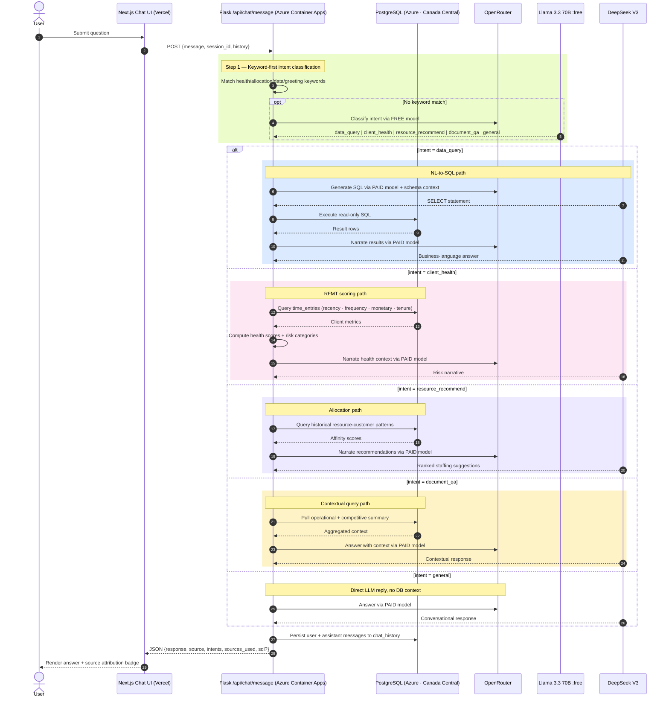

# Chat Lifecycle Sequence Diagram

```mermaid
sequenceDiagram
  autonumber
  actor U as User
  participant UI as Next.js Chat UI (Vercel)
  participant API as Flask /api/chat/message (Azure Container Apps)
  participant DB as PostgreSQL (Azure · Canada Central)
  participant OR as OpenRouter
  participant FREE as Llama 3.3 70B :free
  participant PAID as DeepSeek V3

  U->>UI: Submit question
  UI->>API: POST {message, session_id, history}

  rect rgb(236, 252, 203)
    Note over API: Step 1 — Keyword-first intent classification
    API->>API: Match health/allocation/data/greeting keywords
    opt No keyword match
      API->>OR: Classify intent via FREE model
      FREE-->>API: data_query | client_health | resource_recommend | document_qa | general
    end
  end

  alt intent = data_query
    rect rgb(219, 234, 254)
      Note over API,PAID: NL-to-SQL path
      API->>OR: Generate SQL via PAID model + schema context
      PAID-->>API: SELECT statement
      API->>DB: Execute read-only SQL
      DB-->>API: Result rows
      API->>OR: Narrate results via PAID model
      PAID-->>API: Business-language answer
    end

  else intent = client_health
    rect rgb(252, 231, 243)
      Note over API,DB: RFMT scoring path
      API->>DB: Query time_entries (recency · frequency · monetary · tenure)
      DB-->>API: Client metrics
      API->>API: Compute health scores + risk categories
      API->>OR: Narrate health context via PAID model
      PAID-->>API: Risk narrative
    end

  else intent = resource_recommend
    rect rgb(237, 233, 254)
      Note over API,DB: Allocation path
      API->>DB: Query historical resource-customer patterns
      DB-->>API: Affinity scores
      API->>OR: Narrate recommendations via PAID model
      PAID-->>API: Ranked staffing suggestions
    end

  else intent = document_qa
    rect rgb(254, 243, 199)
      Note over API,DB: Contextual query path
      API->>DB: Pull operational + competitive summary
      DB-->>API: Aggregated context
      API->>OR: Answer with context via PAID model
      PAID-->>API: Contextual response
    end

  else intent = general
    Note over API,OR: Direct LLM reply, no DB context
    API->>OR: Answer via PAID model
    PAID-->>API: Conversational response
  end

  API->>DB: Persist user + assistant messages to chat_history
  API-->>UI: JSON {response, source, intents, sources_used, sql?}
  UI-->>U: Render answer + source attribution badge
```
