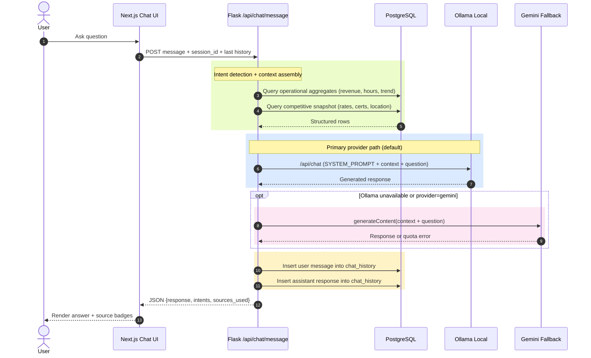

# Chat Lifecycle Sequence Diagram

```mermaid
sequenceDiagram
  autonumber
  actor U as User
  participant UI as Next.js Chat UI
  participant API as Flask /api/chat/message
  participant DB as PostgreSQL
  participant O as Ollama Local
  participant G as Gemini Fallback

  U->>UI: Ask question
  UI->>API: POST message + session_id + last history

  rect rgb(236, 252, 203)
    Note over API: Intent detection + context assembly
    API->>DB: Query operational aggregates (revenue, hours, trend)
    API->>DB: Query competitive snapshot (rates, certs, location)
    DB-->>API: Structured rows
  end

  rect rgb(219, 234, 254)
    Note over API,O: Primary provider path (default)
    API->>O: /api/chat (SYSTEM_PROMPT + context + question)
    O-->>API: Generated response
  end

  opt Ollama unavailable or provider=gemini
    rect rgb(252, 231, 243)
      API->>G: generateContent(context + question)
      G-->>API: Response or quota error
    end
  end

  rect rgb(254, 243, 199)
    API->>DB: Insert user message into chat_history
    API->>DB: Insert assistant response into chat_history
  end

  API-->>UI: JSON {response, intents, sources_used}
  UI-->>U: Render answer + source badges
```

