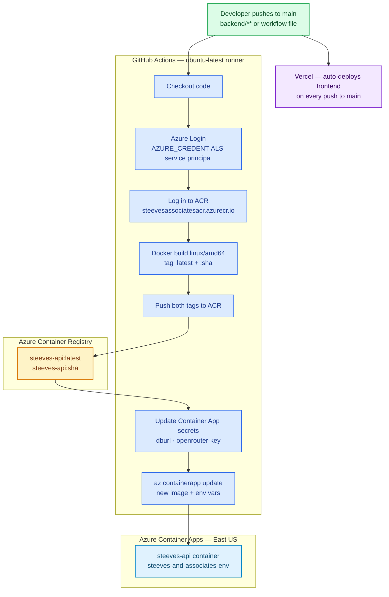

# CI/CD Pipeline Diagram

## Required GitHub Secrets

| Secret | Value |
|--------|-------|
| `AZURE_CREDENTIALS` | Azure service principal JSON (`az ad sp create-for-rbac`) |
| `ACR_NAME` | `steevesassociatesacr` |
| `ACR_LOGIN_SERVER` | `steevesassociatesacr.azurecr.io` |
| `RESOURCE_GROUP` | `steeves-and-associates-rg` |
| `CONTAINERAPP_NAME` | `steeves-api` |
| `DATABASE_URL` | PostgreSQL URL with URL-encoded password (`@`→`%40`, `#`→`%23`) |
| `OPENROUTER_API_KEY` | `sk-or-v1-...` |
| `CORS_ORIGINS` | `https://steeves-and-associates.vercel.app,http://localhost:3000` |

## Trigger Conditions

- **Automatic**: push to `main` touching `backend/**` or `.github/workflows/deploy-backend.yml`
- **Manual**: GitHub UI → Actions → "Deploy Backend" → "Run workflow" (`workflow_dispatch`)

## Notes

- Runner is `ubuntu-latest` (amd64) — image is natively compatible with Azure Container Apps, no `--platform` flag needed
- `DATABASE_URL` and `OPENROUTER_API_KEY` are stored as Container App secrets (`secretref:`) to avoid shell-interpolating special characters
- Both `:sha` and `:latest` tags are pushed; the SHA tag is what gets deployed (immutable, traceable per commit)
